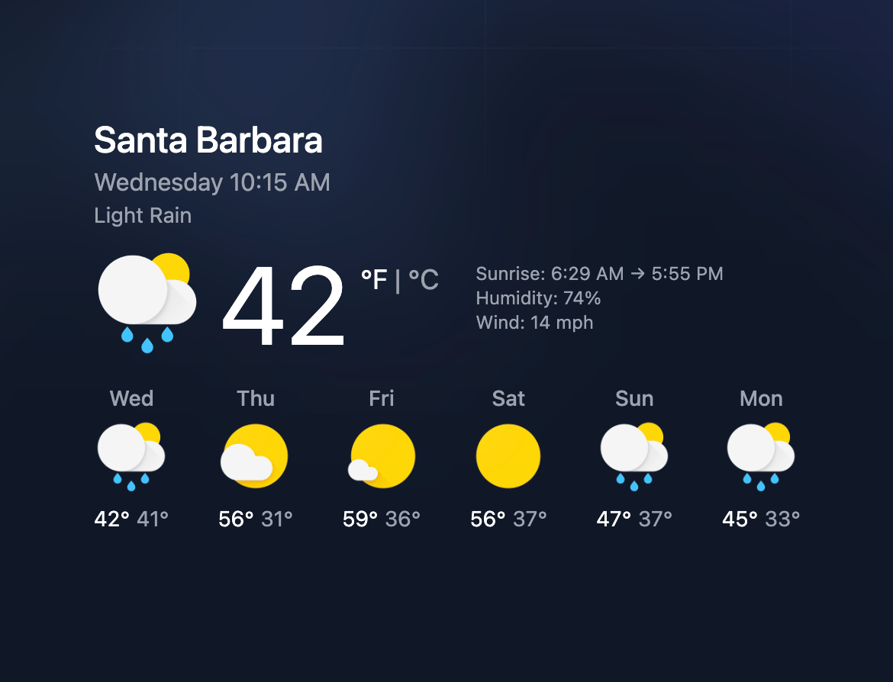

# lit-weather

Lit powered weather forecast web component, leveraging the OpenWeatherMap API. It's customizable with tailwindcss, lightweight, and shadow dom free. Replaces [paper-weather](https://github.com/ryanburns23/paper-weather)



## Installation

```bash
pnpm i -S lit-weather
```

## Usage

```tsx
import 'lit-weather';

<lit-weather api-key="API_KEY" query="ZIP_CODE_OR_CITY" />;
```

```html
<script type="module" src="lit-weather.js" />

<lit-weather api-key="API_KEY" query="ZIP_CODE_OR_CITY" />;
```

## Styles

Shadow root is turned off, styles are accessible just like any other html element. This is done so that you can style the component to your liking and we can use tailwindcss without shipping any css. We provide classes for each element in the component.

If you do not overwrite the styles and want to use the default tailwind classes, you must either import the `dist/tw.css` file or include the `dist/dist/src/LitWeather.js` in your tw configs content array.

```js
/** @type {import('tailwindcss').Config} */
module.exports = {
  darkMode: 'class',
  content: ['node_modules/lit-weather/dist/src/LitWeather.js'],
  theme: {
    extend: {},
  },
  plugins: [],
};
```

## Frameworks

This should work in any framework that supports web components. If you have any issues, please open an issue.

## Aknowledgements

- Weather Icons by [Naman Rastogi](https://www.uplabs.com/posts/google-now-weather-icons-freebie)
- Weather data from [OpenWeatherMap](https://openweathermap.org/)
